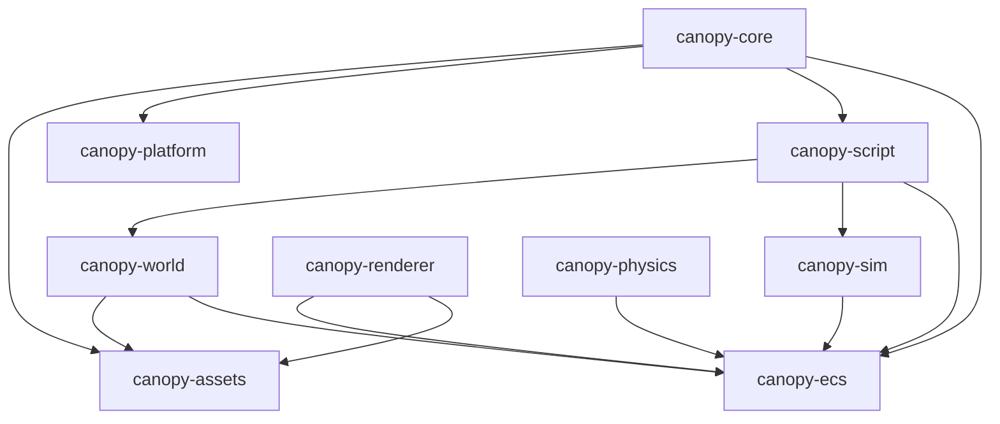

# Canopy Engine Architecture

Canopy is a high-performance, hybrid Rust/Python game engine designed specifically for large-scale simulation games like city builders and open-world RPGs.

## Design Philosophy

1.  **Rust Core, Python Scripting**: Performance-critical systems (ECS, Rendering, Physics, Asset I/O) are written in Rust. Game logic, high-level simulation behavior, and event handling are written in Python via PyO3.
2.  **Simulation-First**: The architecture prioritizes "Simulation Heartbeats" over just frame-rate. Large-scale aggregates are processed at lower frequencies (4Hz) while visual feedback remains at 60Hz+.
3.  **Zero-Parsing Assets**: The `.canasset` format is designed for memory-mapping, allowing the engine to "load" gigabytes of mesh and texture data with near-zero CPU overhead.
4.  **Predictive Streaming**: Chunks are loaded based on camera velocity and look-ahead vectors to eliminate stutter in large procedural worlds.

## Crate Dependency Graph

## Core Subsystems

### 1. canopy-ecs (The Backbone)
A sparse-set based Entity Component System.
- **Sparse Sets**: Enables O(1) lookups and cache-friendly dense storage for components.
- **Archetypes**: Groups entities by component signature for fast query filtering.
- **Command Buffers**: Structural changes (spawn/despawn) are deferred to the end of stages to avoid iterator invalidation and borrow-checker conflicts.

### 2. canopy-script (The Bridge)
Uses PyO3 to expose Rust types to Python.
- **Thread-Local World**: During the Python tick, a thread-local pointer provides Python code with safe access to the ECS World.
- **Decorators**: `@on_tick` and `@on_event` allow Python functions to be hooked into the engine lifecycle with minimal boilerplate.
- **GIL Management**: The engine releases the Global Interpreter Lock (GIL) during heavy Rust computations and acquires it only when calling into Python systems.

### 3. canopy-sim (Large-Scale Simulation)
- **Flow-Based Traffic**: Uses fluid dynamics principles and BPR (Bureau of Public Roads) functions instead of individual agent pathfinding, allowing for hundreds of thousands of vehicles.
- **Statistical Bucketing**: Entities outside the "Active Simulation Radius" are collapsed into statistical pools (StatPools) to maintain global economic causality without individual agent overhead.

### 4. canopy-world (Chunked Universe)
- **Predictive Streaming**: Uses camera velocity to pre-load chunks.
- **Terrain**: Noise-based Fbm Perlin terrain generation integrated into the streaming pipeline.
- **Zone Map**: A sparse spatial grid for city zoning, enabling fast radius queries for disaster impact and economic influence.

## Lifecycle of a Frame

1.  **Pre-Update**: OS events (input, window) are polled and translated to `CanopyEvent`.
2.  **Sim-Tick (Heartbeat)**: If the heartbeat timer (e.g., 4Hz) fires, simulation systems (Economics, Population, Long-term logic) run.
3.  **Update**: Main game logic systems run. `ScriptRunner` executes Python systems here.
4.  **Post-Update**: Transform hierarchies are updated; camera culling and LoD selection occurs.
5.  **Render**: `canopy-renderer` submits draw calls to the GPU via `wgpu`.
6.  **Post-Render**: Profiling data is flushed; frame-end cleanup.
